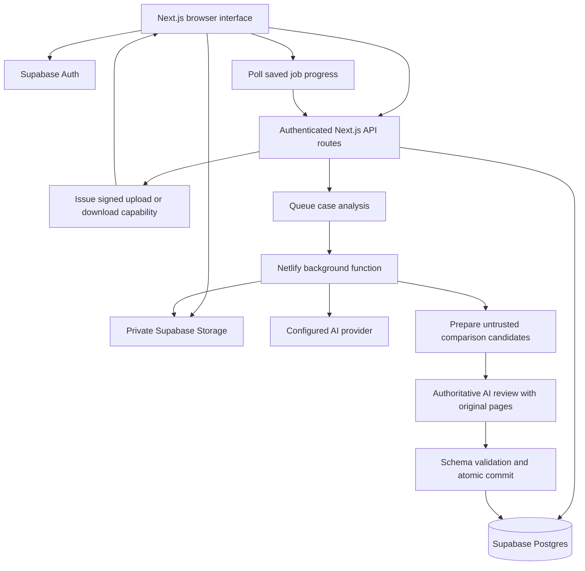

# Samrat workflow architecture

Samrat keeps the case-document review part of Kalika and runs as a separate application. The original `../autodealer-workflow-main` directory is unchanged. No original environment files, business documents, customer records, or credentials were copied into this project.

## What was retained and removed

The original repository has a web app under `apps/web`, an API and packet worker under `apps/api`, shared definitions, and separate Tally/related integration applications. Samrat consolidates its required web and API routes into one Next.js app, with three Netlify functions for background processing and housekeeping.

| Area                                | Samrat implementation                                                                                             |
| ----------------------------------- | ----------------------------------------------------------------------------------------------------------------- |
| Sign-in and sessions                | Supabase password sign-in, verified server sessions, safe login redirects                                         |
| Dashboard and navigation            | Samrat branding, real case counts, recent cases, responsive navigation                                            |
| New case                            | PDF/image intake, direct private uploads, draft or start analysis                                                 |
| Case directory                      | Original list/card presentation, search, pagination, status badges                                                |
| Detail screen                       | Original source preview, extracted fields, commercial line items, review summary                                  |
| Mismatch screen                     | Original grouped evidence comparison; accept/reject one or several issues; correct a saved issue decision         |
| Extraction and comparison           | Adapted original document schema, AI extraction, field normalization, line-item checks, grouping and terms checks |
| Review settings                     | Document/field selection and issue group settings, saved together atomically                                      |
| Recycle bin                         | Confirmed recycle, restore and permanent deletion; no automatic 30-day purge                                      |
| Tally, ERP, ledgers and collections | Excluded: no pages, API routes, connection controls, queue tables, or bridge applications                         |

Company-specific identity rules and default GST-state assumptions were removed. Buyer and supplier identity must come from the documents. Missing evidence is not filled with Kalika's details or a guessed Samrat GSTIN.

## Request and data flow

Large files do not pass through a Next.js function request. The browser hashes each file, asks the API for an upload reservation, uploads to a unique private Storage path, and submits only reservation IDs. The API checks owner, expiry, file information and limits before attaching uploads to a case. Processing checks the file hash again before reading it.

The background worker claims a queued job exactly once, reads the packet, renders PDF pages in Node, extracts structured data, and prepares untrusted comparison candidates. One authoritative reviewer then sees the complete packet and original page images, corrects extraction, decides packet and seller-chain roles, adjudicates all candidate mismatches, and evaluates the terms checklist. Its result is schema-validated and committed without later semantic enrichment. Results and any smart-split sibling cases are committed in one database transaction. A failed or superseded run cannot partially replace the previous result set.

The browser can leave the page while processing continues. The scheduled retry function scans queued jobs every five minutes and recovers a worker lease after twenty minutes. A job gets at most two attempts. Model requests have a shared processing deadline near thirteen minutes, within Netlify's documented fifteen-minute background window. The actual cloud runtime still needs a live smoke test with the user's accounts.

## Review rules

The complete rule inventory and Kalika-to-Samrat adaptations are documented in [REVIEW_INTELLIGENCE.md](./REVIEW_INTELLIGENCE.md).

- New cases start as `draft`, then move through `processing` to `completed` or `failed`.
- `completed` means analysis finished and a human decision is still needed; it does not mean approved.
- A case with no issues can be accepted directly. A case with issues can be accepted only after every persisted issue is accepted.
- Accepting the final issue automatically marks the case `accepted`. Rejecting an issue keeps the case available for review and blocks acceptance. The reviewer can reject the whole case separately.
- Changing an accepted issue to rejected returns the case to review. Each issue decision and case action creates a database audit event; there is no separate audit-history screen in this version.
- Comparison retains the original domain rules: purchase-order grand totals are not directly compared with invoice totals because partial fulfilment is possible. Invoice-linked document totals and relevant line-item differences are checked. Formatting sensitivity remains selectable.
- A single document provides limited comparison evidence. “No issues” is not proof that a document is valid or complete.
- Smart splitting requires supported document anchors and related source files. Split-case reprocessing is blocked to avoid duplicating siblings or replacing their independent reviews. Submit corrected documents as a new case.

## Database and access model

The first-install migration creates ten application tables. `packet_cases` is the owner record; files, extracted documents, mismatches, and processing jobs belong to a case. `storage_assets` tracks upload reservations and reuse; `case_review_events` records actions. Three tables store shared review settings.

All tables have row-level security. Browser roles can read only the permitted records belonging to their user and cannot write application tables or call internal mutation functions. Server routes verify the Supabase user, check ownership and use restricted database functions for workflow transitions. Storage is private; access uses temporary signed capabilities.

**This follows the original per-user case access model.** It does not implement uploader/reviewer roles, team assignment or organization-wide case access. Do not share one password among several staff. Agree on and implement team permissions before several individuals need to collaborate on the same cases. Review settings apply across the dedicated project, so only trusted staff should be invited and public sign-ups must remain disabled.

## Source map

| Path                                         | Responsibility                                                                |
| -------------------------------------------- | ----------------------------------------------------------------------------- |
| `src/components/workspace/WorkspacePage.tsx` | Intake and draft creation                                                     |
| `src/components/cases/`                      | Case directory, details, mismatch review and recycle bin                      |
| `src/lib/case-persistence.ts`                | Browser upload and case API client                                            |
| `src/app/api/`                               | Authenticated API routes                                                      |
| `src/server/process-job.ts`                  | Durable analysis orchestration                                                |
| `src/server/processing/`                     | File processing, models, PDF renderer and deadline                            |
| `src/server/services/verification.ts`        | Related-document and commercial line-item checks                              |
| `src/lib/packet-intelligence.ts`             | Duplicate, multi-shipment, seller-chain, and reviewer-action intelligence     |
| `supabase/migrations/`                       | Schema, policies, workflow functions and private bucket                       |
| `netlify/functions/`                         | Background worker, retries and orphaned-upload cleanup                        |
| `tests/`                                     | Real local SQL tests, renderer/comparison tests and isolated preview fixtures |

## Deployment boundary

One Netlify project hosts Next.js pages, authenticated API routes, and the three functions. Supabase hosts Auth, Postgres, and private Storage. Initial extraction and candidate preparation use Gemini 2.5 Flash through OpenRouter. The independent authoritative review defaults to Gemini 2.5 Pro with high reasoning and may be overridden with `OPENROUTER_REVIEW_MODEL`. There is no automatic provider fallback. Supabase alone does not extract documents.

The daily cleanup removes up to 100 unreferenced uploads older than twenty-five hours. Recycling alone does not delete a file. Permanent case deletion removes database records; unused Storage bytes are removed later by cleanup. Shared files used by split siblings remain until no case references them.

Cloud configuration, model access, billing, backups, data handling and the first real packet must be verified by following [SETUP.md](../SETUP.md). Nothing has been provisioned or deployed on the user's behalf.
